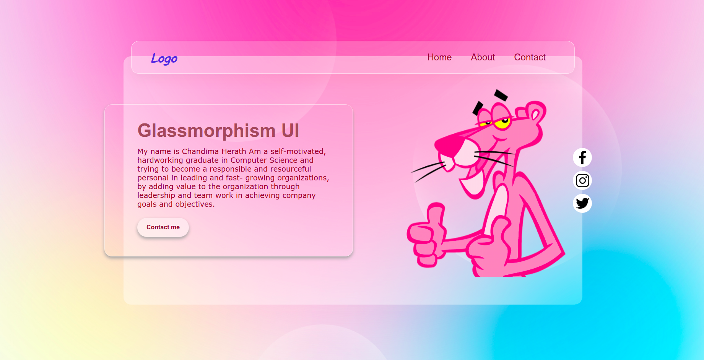

# Glassmorhism-UI

---
---

### Contents of this file
* Introduction
* User guide to use
* License

---

### Introduction

* A simple landing page developed using HTML and CSS highlighting the glassmorphism effect.

---

### How to use

* Clone the repository
* Open with VS Code
* Right click on the index.html file
* Open with the live server

---

       (Main View)
